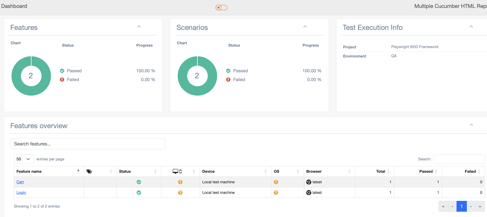

# 🧪 Playwright Test Automation Framework (POM + BDD)

This project demonstrates a **professional QA automation framework** built using:

- 🎭 Playwright  
- 🥒 Cucumber (BDD)  
- 🟦 TypeScript  
- 📊 HTML Reporting  

It showcases an advanced automation approach combining **Page Object Model (POM)** and **Behavior-Driven Development (BDD)**.

---

## 📁 Project Structure

```
pright/

├── features/                # BDD feature files (Gherkin)
├── steps/                   # Step definitions (Cucumber)

├── tests/
│   ├── pages/               # Page Object Model classes
│   ├── constants/           # Test data

├── reports/                 # JSON + HTML reports (generated)
├── types/                   # TypeScript custom declarations

├── report.ts                # HTML report generator
├── tsconfig.json            # TypeScript configuration
├── playwright.config.ts     # Playwright configuration
└── package.json
```

---

## 🚀 Features

- End-to-end UI testing with Playwright  
- Page Object Model (POM) design pattern  
- BDD with Cucumber (Gherkin syntax)  
- JSON reporting  
- HTML report generation  
- TypeScript support  
- Clean and scalable architecture  

---

## ▶️ Getting Started

### 1. Install dependencies

```
npm install
```

### 2. Install Playwright browsers

```
npx playwright install
```

---

## 🧪 Run Tests (BDD)

```
npm run bdd
```

This will:
- Execute feature files  
- Generate JSON report  

---

## 📊 Generate HTML Report

```
npm run report
```

Then open:

```
reports/html-report/index.html
```

---

## 🔁 Run Everything (Tests + Report)

```
npm run bdd:report
```

---

## 🧠 Framework Architecture

```
Feature File (Gherkin)
        ↓
Step Definitions (Cucumber)
        ↓
Page Object Model (Playwright)
        ↓
Browser Execution
        ↓
JSON Report
        ↓
HTML Report
```

---

## ⚙️ TypeScript Configuration

TypeScript is configured via `tsconfig.json` to:
- Resolve modules correctly  
- Support ES imports  
- Enable execution using `ts-node`  

---

## ⚠️ Handling External Libraries (TypeScript)

Some libraries do not provide TypeScript definitions.

To handle this, a custom declaration file is used:

```
types/multiple-cucumber-html-reporter.d.ts
```

With:

```
declare module 'multiple-cucumber-html-reporter';
```

---

## 📸 HTML Report Preview

---

## 🚀 Future Improvements

- Add screenshots on failure  
- Integrate CI/CD (GitHub Actions)  
- Multi-browser execution  
- Environment-based configuration  

---

## 👨‍💻 Author

Mohammad  

QA Engineer | Playwright | BDD | Test Automation  

---

## ⭐ Notes

This project demonstrates **real-world QA engineering practices**, including:
- Scalable test architecture  
- Separation of concerns  
- Maintainability  
- Professional reporting  